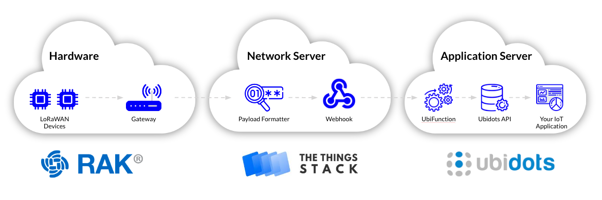
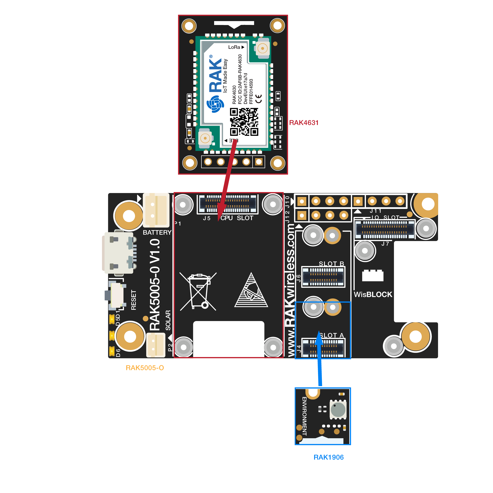

# ttc-wisblock-workshop

When it comes to making IoT device prototypes, we generally think in a protoboard with a development board, a couple of attached sensors, and a bunch of cables going from one side to the other. Additionally, headaches arise when it is time to perform tests in the real environment, as this is where the actual failures appear. With [WisBlock](https://docs.rakwireless.com/Product-Categories/WisBlock/), a new concept for agile hardware development, you can now rapidly create prototypes in a secure and scalable way avoiding the necessity of reworking the solution deployed.

In this step-by-step guide, you will go all over the different layers required in the deployment of an IoT solution, Device & Connectivity, Application Management, Analytics, and Visualization. After handle this guide, you will be capable of developing an end IoT solution for any industry over LoRaWAN using the WisBlock, and [Ubidots](https://ubidots.com/) as IoT Platform.

Before getting down to the final solution, let's understand the basic workflow of a LoRaWAN connected IoT application:



1. First, LoRaWAN Devices must be transmitting data over a gateway to The Things Stack
2. With our devices transmitting data, we must use a Payload Formatter to translate the incoming sensor data to a JSON payload
3. Then, to integrate our devices with a Third Party platform such as Ubidots, we must have to create a webhook
4. To finish, we have to create our own customized API using UbiFunctions to finally report the data in our Ubidots account where it can be visualized by our customers

Without further ado, hacking time! 

> NOTE: This guide assumes that you already have an agteway lorawan deployed, and fully operational. 

## Integration Requirements:

* [WisBlock Based Board: RAK5005-O](https://store.rakwireless.com/products/rak5005-o-base-board)
* [WisBlock LPWAN Module: RAK4631](https://store.rakwireless.com/products/rak4631-lpwan-node)
* [WisBlock Environmental Sensor: RAK1906](https://store.rakwireless.com/products/rak1906-bme680-environment-sensor)
* [LoRaWAN gateway configured in The Things Stack](https://store.rakwireless.com/products/rak-discover-kit-2)
* The Things Stack account. *Don’t have a The Things Stack account yet? Sign up [here](ttc.eu1.cloud.thethings.industries) (Europe) or [here](ttc.nam1.cloud.thethings.industries) (US).*
* Ubidots account. *Don't have an Ubidots account yet? Sign up [here](https://industrial.ubidots.com/accounts/signup_industrial/)*

## Step-by-Step

1. The Thing Stack Setup
2. The Thing Stack & Ubidots integration
3. Ubidots Platform Setup
4. WisBlock Setup

## 1. The Thing Stack Setup

1. Access to your The Things Stack console, and access to "Applications".
2. Create a new application by clicking on the "**Add application**" button. Fill up all the fields required to create a new application, then click on "**Create application**"
3. Once the Application is created, you must add the "**End Devices**" desired to be register within the application. End devices registration can be done manually [on the platform](https://www.thethingsindustries.com/docs/devices/adding-devices/), or using the [Importable JSON file](https://www.thethingsindustries.com/docs/getting-started/migrating/device-json/). Regardless the option used to add the end devices, WisBlock end devices must be register using the following parameters: 
* **lorawan_version**: MAC_V1_0_2
* **lorawan_phy_version**: PHY_V1_0_2_REV_B
4.  Go to "**Payload Fomatter > Uplink**". Then, choose "**Javascript**" as Formatter Type, and place the [payload formatter code](https://github.com/rakstars/ttc-wisblock-workshop/blob/main/payload_formatter.js). To finish, click on "**Save changes**"

```js
// WisBlock Enviromental Data Frame Example: 0x0109CE104D00018A510000F848

function Decoder(bytes, port) {
    // Decode an uplink message from a buffer
    // (array) of bytes to an object of fields.
    var decoded = {};
    // Check which data we received
    if (bytes[0] == 1) {
        // Received data is Environment Monitoring data
        decoded.temperature = (bytes[1] << 8 | (bytes[2])) / 100;
        decoded.humidity = (bytes[3] << 8 | (bytes[4])) / 100;
        decoded.pressure = (bytes[8] | (bytes[7] << 8) | (bytes[6] << 16) | (bytes[5] << 24)) / 100;
        decoded.gas = bytes[12] | (bytes[11] << 8) | (bytes[10] << 16) | (bytes[9] << 24);
    } else if (bytes[0] == 7) {
// add more sensor data formats here
//        } else if (bytes.[0] == xx) {
    }
    return decoded;
}
```

Once the WisBlock Enviromental data is translated to a human readable format, you will get a JSON key value object like the following one: 

```json
{
    temperature: 26.3,
    humidity: 53,
    pressure: 846.0,
    gas:82865
}
```

> NOTE: The decoder code provided is just compatible with the [WisBlock Environmental Monitoring Solution Example](https://github.com/RAKWireless/WisBlock/tree/master/examples/solutions/Environment_Monitoring). Refer to the [data format](https://github.com/RAKWireless/WisBlock/tree/master/examples/solutions/Environment_Monitoring#data-format) section to evaluate the entire data frame sent by the WisBlock + Environmental sensor. 

## 2. The Thing Stack & Ubidots integration

Now, to communicate with our Ubidots account, let's do the configuration of a Webhook in The Things Stack.  To do this, an HTTP request will be executed to exchange data from a client to a server. In this case The Things Stack refers to the client, and Ubidots to the server. 


To be able to exchange data, and at the same time manipulate both incoming and outgoing requests, we will use the [UbiFunctions](https://help.ubidots.com/en/articles/2132086-analytics-ubifunctions-user-guide) module offered by Ubidots, a Function as a Service module where we can make calls to our own APIs either using Python or NodeJS.

1. In your Ubidots account, go to "**Devices > Functions**", and click on "**Add new function**". To create the UbiFunction you must define:

* **Name**: An identifier for the function to be created. For example "*WisBlock Environmental Monitoring*"
* **Method**: POST
* **Runtime**: NodeJS 10 
* **Time-based trigger**: Disable 

Then, replace the code provided by default with the [following one](ubi_function.js): 

```js
// Import the 'axios' library so we can make HTTP request from the function
var axios = require("axios");
 
// Define Ubidots constant
const UBI_TOKEN = "BBFF-xxxxxxx"; // Assign your Ubidots account
const UBI_URL = "https://industrial.api.ubidots.com/api/v1.6";
 
// Main function - runs every time the function is executed.
// "args" is a dictionary containing both the URL params and the HTTP body (for POST requests).
async function main(args) {
  var data = {};

  var devID = args['end_device_ids']['device_id']; 
  var payload = args['uplink_message']['decoded_payload'];
  
  console.log(devID);
  console.log(payload);

  // Send data to Ubiodpts variables' values to Ubidots
  var req = await ubidotsDataUpdate(UBI_TOKEN, devID, payload);
  
  return {"status": req};
}
 
/*
* Handle a POST request to Ubidots API
* API Documentation: https://ubidots.com/docs/sw/
*
* @arg token [Mandatory], Ubidots account's Token
* @arg deviceLabel [Mandatory], single and unique label of device
* @arg payload [Mandatory], variables and values to be sent in a JSON format
*
* @return response/error, request response
*/
async function ubidotsDataUpdate(token, deviceLabel, payload) {
 
 var endpoint = UBI_URL.concat("/devices/" + deviceLabel);
  return axios.post(endpoint, payload, {
   headers: {
     "content-type": "application/json",
     "X-Auth-Token": token
   }
 })
 .then(function (response) {
   return response.statusText;
 })
 .catch(function (error) {
   return error.response.status;
 });
}
```

After pasting the code, make sure to assign your [Ubidots TOKEN](https://help.ubidots.com/en/articles/590078-find-your-token-from-your-ubidots-account) where is indicated. To finish, click on the "**Make it live**" button. 

At this point, you'll noticed the **HTTPs Endpoint URL** field containing the URL generated by the UbiFunction – this will be used by The Thing Stack to handle the HTTP requests with Ubidots. 

2. In the application overview on The Things Stack console, go to "**Integrations > Webhook**", and click on "**Add webhook**". Then, select "**Ubidots**" as webhook integration template. To create setup the integration fill up the following information required, Webhook ID, Ubidots username, and UbiFunction name. 

> NOTE: To assure a proper integration between The Things Stack and Ubidots, you must use lowercase letters and dashes instead of capitalcase letters and whitespace. 

## 3. Ubidots Platform Setup

Registered devices sending data to Ubidots will be automatically created in your Ubidots account. However, if you are seeking to pre-provision devices to create custom devices and variables names, properties, colors, icons, units, among other options, we invite you you explore the different features modules that Ubidots provide to make the management of thousand of devices easily.

**Useful resources**: 

* [Ubidots Basics: Devices, Variables, Dashboards, and Alerts](https://help.ubidots.com/en/articles/854333-ubidots-basics-devices-variables-dashboards-and-alerts)
* [Ubidots Basics: Applications, Organizations, and Users Explained](https://help.ubidots.com/en/articles/887328-ubidots-basics-applications-organizations-and-users-explained)


### 1. Devices Types Setup

The Device Types module allows you to configure devices properties, appearance, and variables to automate onboarding of thousand of devices.

To create a devices type just go to "**Devices > Types**". Then, click on the plus icon to create a new device type, and fill up all the information required to match your application requirements and be able to onboard thousand of custom devices.

> Check out the [official module documentation](https://help.ubidots.com/en/articles/2129204-device-types) to check out all the details about it.

#### Bulk Create Devices Setup

The Bulk Create Devices module allows you to create devices in bulk simply with a CSV file containing Devices Names, API Labels, and Properties. 

To add devices in bulk go to "**Devices > Devices**". Then, click on the plus icon and select the "**Bulk devices**" option. Download the CSV template, fill up the file with the devices information, as well as any additional property desired to be created. Upload the file, and save the changes. 

> Check out the [official module documentation](https://help.ubidots.com/en/articles/2413962-devices-types-bulk-device-creation-using-a-csv-file) to check out all the details about it.

### 2. Devices Group Setup

The Devices Group module execute different kind of operations across thousand of devices with just a click. This feature allow you to add/miove devices to an organization, create global events across an entire devices network among other options. 

To create a devices group go to "**Devices > Groups**". Then, select the plus icon to create a new device group. Assign a name to the group of devices to be created and select all the devices desired to be included in the device group.

> Check out the [official module documentation](https://help.ubidots.com/en/articles/2383520-device-groups) to check out all the details about it.

### 3. Dashboards & Widgets Setup

The Dashboards module allow any user to understand sensors data and control devices remotely for any an IoT solution. Ubidots offer different dashboards types:

* **Statics dashboards**: Allow you to visualize data form predetermined devices and variables. 

* **Dynamic dashboards**: Allow you to visualize data from different devices and variables, using a dropdown menu located in the settings bar. 

On the widget side, offer a wide variety of options to visualize the data as you prefer. Among their big list of widget options, there is an [HTML Canvas widget](https://help.ubidots.com/en/articles/754634-html-canvas-widget-examples) that allows any user to create their own widgets to fully match the solutions needs in the case is need it.

To create a dashboard go to "**Data > Dashboards**", click on the plus icon to create a new dashboard. Then, to create a widget click on "**Add a new widget**", choose the desired widget and define the desired settings for it. 

> Check out the [official module documentation](https://help.ubidots.com/en/articles/2400308-create-dashboards-and-widgets) to check out all the details about it.

### 4. Events Setup

The Events module support different kind of events that allow you to send alerts and notifications. Among their options: notifications via Email, SMS, Telegram, Slack, phone calls. Also, webhook and geofence triggers. 

To create an event go to "**Data > Events**", click on the plus icon to create a new event. Select the devices and variable desired to be evaluated, alongside the trigger condition. Then select, the action desired to be executed, and save the changes.

> Check out the [official module documentation](https://help.ubidots.com/en/articles/1445537-events-creating-conditional-events-and-alerts) to check out all the details about it.

### 5. Organizations Setup

The organization module allow you to segmentate the Ubidots license into multiple customer or any sub-division of entity resources in the account. 

To create an organization go to "**Users > Organizations**". Then, click on the plus icon to add a new organization. Assign a name to it, and choose the application desired to be associated with it. 

> Check out the [official module documentation](https://help.ubidots.com/en/articles/4394523-user-management-activate-an-organization-to-the-app) to check out all the details about it.

### 6. End Application

Ubidots App(s) allow create custom IoT Portals holding Organizations, and set of configurations that define its appearance, custom domain, locale, visible features, and language.


> Check out the [official module documentation](https://help.ubidots.com/en/articles/2218155-ubidots-app-s) to check out all the details about it.


## 4. WisBlock Setup

Getting started with WisBlock is pretty simple. Follow the next steps, and you're ready to start hacking! 

1. Setup the software development environment of your preference:
    * [Setup Arduino™ IDE](https://docs.rakwireless.com/Knowledge-Hub/Learn/Installation-of-Board-Support-Package-in-Arduino-IDE/)
    * [Setup PlatformIO](https://docs.rakwireless.com/Knowledge-Hub/Learn/Board-Support-Package-Installation-in-PlatformIO/)

2. Setup the hardware based on the development application. For the purpose of this guide, we'll be setting up an environmental sensor. For this, make sure to attached the modules required in the respective slots: 



3. To begin sending data to The Things Stack, open the Arduino IDE or PlatformIO and paste the sample code below. Once you have pasted the code, make sure to assign the LoRa parameters required to match the project with your region – the **default region is US915**.

* **Arduino**: The parameters can be defined under the "**Tools**" tab. 
* **PlatformIO**: You must define the region in the platform.init file Setup a flag for the region under the `platform.init` file: `#build_flags = -D REGION_EU868`

```c++
/**
 * @file Environment_Monitoring.ino
 * @author rakwireless.com
 * @brief This sketch demonstrate how to get environment data from BME680
 *    and send the data to lora gateway.
 * @version 0.1
 * @date 2020-07-28
 * 
 * @copyright Copyright (c) 2020
 * 
 * @note RAK5005-O GPIO mapping to RAK4631 GPIO ports
   RAK5005-O <->  nRF52840
   IO1       <->  P0.17 (Arduino GPIO number 17)
   IO2       <->  P1.02 (Arduino GPIO number 34)
   IO3       <->  P0.21 (Arduino GPIO number 21)
   IO4       <->  P0.04 (Arduino GPIO number 4)
   IO5       <->  P0.09 (Arduino GPIO number 9)
   IO6       <->  P0.10 (Arduino GPIO number 10)
   SW1       <->  P0.01 (Arduino GPIO number 1)
   A0        <->  P0.04/AIN2 (Arduino Analog A2
   A1        <->  P0.31/AIN7 (Arduino Analog A7
   SPI_CS    <->  P0.26 (Arduino GPIO number 26) 
 */

#include <Arduino.h>
#include <LoRaWan-RAK4630.h> //http://librarymanager/ALL#SX126x-Arduino
#include <SPI.h>

#include <Wire.h>
#include "ClosedCube_BME680.h" //http://librarymanager/ALL#ClosedCube_BME680_Arduino
#include <U8g2lib.h>		   //http://librarymanager/ALL#u8g2

U8G2_SSD1306_128X64_NONAME_F_HW_I2C u8g2(U8G2_R0);
ClosedCube_BME680 bme680;

// RAK4630 supply two LED
#ifndef LED_BUILTIN
#define LED_BUILTIN 35
#endif

#ifndef LED_BUILTIN2
#define LED_BUILTIN2 36
#endif

bool doOTAA = true;
#define SCHED_MAX_EVENT_DATA_SIZE APP_TIMER_SCHED_EVENT_DATA_SIZE /**< Maximum size of scheduler events. */
#define SCHED_QUEUE_SIZE 60										  /**< Maximum number of events in the scheduler queue. */
#define LORAWAN_DATERATE DR_0									  /*LoRaMac datarates definition, from DR_0 to DR_5*/
#define LORAWAN_TX_POWER TX_POWER_5								  /*LoRaMac tx power definition, from TX_POWER_0 to TX_POWER_15*/
#define JOINREQ_NBTRIALS 3										  /**< Number of trials for the join request. */
DeviceClass_t gCurrentClass = CLASS_A;							  /* class definition*/
lmh_confirm gCurrentConfirm = LMH_CONFIRMED_MSG;				  /* confirm/unconfirm packet definition*/
uint8_t gAppPort = LORAWAN_APP_PORT;							  /* data port*/

/**@brief Structure containing LoRaWan parameters, needed for lmh_init()
 */
static lmh_param_t lora_param_init = {LORAWAN_ADR_ON, LORAWAN_DATERATE, LORAWAN_PUBLIC_NETWORK, JOINREQ_NBTRIALS, LORAWAN_TX_POWER, LORAWAN_DUTYCYCLE_OFF};

// Foward declaration
static void lorawan_has_joined_handler(void);
static void lorawan_rx_handler(lmh_app_data_t *app_data);
static void lorawan_confirm_class_handler(DeviceClass_t Class);
static void send_lora_frame(void);

/**@brief Structure containing LoRaWan callback functions, needed for lmh_init()
*/
static lmh_callback_t lora_callbacks = {BoardGetBatteryLevel, BoardGetUniqueId, BoardGetRandomSeed,
										lorawan_rx_handler, lorawan_has_joined_handler, lorawan_confirm_class_handler};

//OTAA keys !!! KEYS ARE MSB !!!
uint8_t nodeDeviceEUI[8] = {0x88, 0x88, 0x88, 0x88, 0x88, 0x88, 0x33, 0x33};
uint8_t nodeAppEUI[8] = {0xB8, 0x27, 0xEB, 0xFF, 0xFE, 0x39, 0x00, 0x00};
uint8_t nodeAppKey[16] = {0x88, 0x88, 0x88, 0x88, 0x88, 0x88, 0x88, 0x88, 0x88, 0x88, 0x88, 0x88, 0x22, 0x22, 0x22, 0x22};

// Private defination
#define LORAWAN_APP_DATA_BUFF_SIZE 64										  /**< buffer size of the data to be transmitted. */
#define LORAWAN_APP_INTERVAL 20000											  /**< Defines for user timer, the application data transmission interval. 20s, value in [ms]. */
static uint8_t m_lora_app_data_buffer[LORAWAN_APP_DATA_BUFF_SIZE];			  //< Lora user application data buffer.
static lmh_app_data_t m_lora_app_data = {m_lora_app_data_buffer, 0, 0, 0, 0}; //< Lora user application data structure.

TimerEvent_t appTimer;
static uint32_t timers_init(void);
static uint32_t count = 0;
static uint32_t count_fail = 0;

void setup()
{
	pinMode(LED_BUILTIN, OUTPUT);
	digitalWrite(LED_BUILTIN, LOW);

	// Initialize LoRa chip.
	lora_rak4630_init();

	// Initialize Serial for debug output
	Serial.begin(115200);
	//	while (!Serial)
	//	{
	//		delay(10);
	//	}
	Serial.println("=====================================");
	Serial.println("Welcome to RAK4630 LoRaWan!!!");
	Serial.println("Type: OTAA");

#if defined(REGION_AS923)
	Serial.println("Region: AS923");
#elif defined(REGION_AU915)
	Serial.println("Region: AU915");
#elif defined(REGION_CN470)
	Serial.println("Region: CN470");
#elif defined(REGION_CN779)
	Serial.println("Region: CN779");
#elif defined(REGION_EU433)
	Serial.println("Region: EU433");
#elif defined(REGION_IN865)
	Serial.println("Region: IN865");
#elif defined(REGION_EU868)
	Serial.println("Region: EU868");
#elif defined(REGION_KR920)
	Serial.println("Region: KR920");
#elif defined(REGION_US915)
	Serial.println("Region: US915");
#elif defined(REGION_US915_HYBRID)
	Serial.println("Region: US915_HYBRID");
#else
	Serial.println("Please define a region in the compiler options.");
#endif
	Serial.println("=====================================");

	/* bme680 init */
	bme680_init();

	u8g2.begin();

	//creat a user timer to send data to server period
	uint32_t err_code;

	err_code = timers_init();
	if (err_code != 0)
	{
		Serial.printf("timers_init failed - %d\n", err_code);
	}

	// Setup the EUIs and Keys
	lmh_setDevEui(nodeDeviceEUI);
	lmh_setAppEui(nodeAppEUI);
	lmh_setAppKey(nodeAppKey);

	// Initialize LoRaWan
	err_code = lmh_init(&lora_callbacks, lora_param_init, doOTAA);
	if (err_code != 0)
	{
		Serial.printf("lmh_init failed - %d\n", err_code);
	}

	// Start Join procedure
	u8g2.clearBuffer();					// clear the internal memory
	u8g2.setFont(u8g2_font_ncenB10_tr); // choose a suitable font

	u8g2.drawStr(20, 39, "Joining ...");
	u8g2.sendBuffer(); // transfer internal memory to the display
	lmh_join();
}

void loop()
{
	// Handle Radio events
	Radio.IrqProcess();
}

/**@brief LoRa function for handling HasJoined event.
 */
void lorawan_has_joined_handler(void)
{
	Serial.println("OTAA Mode, Network Joined!");
	u8g2.clearBuffer();					// clear the internal memory
	u8g2.setFont(u8g2_font_ncenB10_tr); // choose a suitable font

	u8g2.drawStr(20, 39, "Joined");
	u8g2.sendBuffer(); // transfer internal memory to the display
					   //delay(2000);

	lmh_error_status ret = lmh_class_request(gCurrentClass);
	if (ret == LMH_SUCCESS)
	{
		delay(1000);
		TimerSetValue(&appTimer, LORAWAN_APP_INTERVAL);
		TimerStart(&appTimer);
	}
}

/**@brief Function for handling LoRaWan received data from Gateway
 *
 * @param[in] app_data  Pointer to rx data
 */
void lorawan_rx_handler(lmh_app_data_t *app_data)
{
	Serial.printf("LoRa Packet received on port %d, size:%d, rssi:%d, snr:%d, data:%s\n",
				  app_data->port, app_data->buffsize, app_data->rssi, app_data->snr, app_data->buffer);
}

void lorawan_confirm_class_handler(DeviceClass_t Class)
{
	Serial.printf("switch to class %c done\n", "ABC"[Class]);
	// Informs the server that switch has occurred ASAP
	m_lora_app_data.buffsize = 0;
	m_lora_app_data.port = gAppPort;
	lmh_send(&m_lora_app_data, gCurrentConfirm);
}

void send_lora_frame(void)
{
	if (lmh_join_status_get() != LMH_SET)
	{
		//Not joined, try again later
		return;
	}
	bme680_get();

	lmh_error_status error = lmh_send(&m_lora_app_data, gCurrentConfirm);
	if (error == LMH_SUCCESS)
	{
		count++;
		Serial.printf("lmh_send ok count %d\n", count);
	}
	else
	{
		count_fail++;
		Serial.printf("lmh_send fail count %d\n", count_fail);
	}
}

/**@brief Function for handling user timerout event.
 */
void tx_lora_periodic_handler(void)
{
	TimerSetValue(&appTimer, LORAWAN_APP_INTERVAL);
	TimerStart(&appTimer);
	Serial.println("Sending frame now...");
	send_lora_frame();
}

/**@brief Function for the Timer initialization.
 *
 * @details Initializes the timer module. This creates and starts application timers.
 */
uint32_t timers_init(void)
{
	TimerInit(&appTimer, tx_lora_periodic_handler);
	return 0;
}

void bme680_init()
{
	Wire.begin();
	bme680.init(0x76); // I2C address: 0x76 or 0x77
	bme680.reset();

	Serial.print("Chip ID=0x");
	Serial.println(bme680.getChipID(), HEX);

	// oversampling: humidity = x1, temperature = x2, pressure = x16
	bme680.setOversampling(BME680_OVERSAMPLING_X1, BME680_OVERSAMPLING_X2, BME680_OVERSAMPLING_X16);
	bme680.setIIRFilter(BME680_FILTER_3);
	bme680.setGasOn(300, 100); // 300 degree Celsius and 100 milliseconds

	bme680.setForcedMode();
}
String data = "";
void bme680_get()
{
	char oled_data[32] = {0};
	Serial.print("result: ");
	uint32_t i = 0;
	memset(m_lora_app_data.buffer, 0, LORAWAN_APP_DATA_BUFF_SIZE);
	m_lora_app_data.port = gAppPort;

	double temp = bme680.readTemperature();
	double pres = bme680.readPressure();
	double hum = bme680.readHumidity();

	uint32_t gas = bme680.readGasResistance();

	data = "Tem:" + String(temp) + "C " + "Hum:" + String(hum) + "% " + "Pres:" + String(pres) + "KPa " + "Gas:" + String(gas) + "Ohms";
	Serial.println(data);

	// display bme680 sensor data on OLED
	u8g2.clearBuffer();					// clear the internal memory
	u8g2.setFont(u8g2_font_ncenB10_tr); // choose a suitable font

	memset(oled_data, 0, sizeof(oled_data));
	sprintf(oled_data, "T=%.2fC", temp);
	u8g2.drawStr(3, 15, oled_data);

	memset(oled_data, 0, sizeof(oled_data));
	snprintf(oled_data, 64, "RH=%.2f%%", hum);
	u8g2.drawStr(3, 30, oled_data);

	memset(oled_data, 0, sizeof(oled_data));
	sprintf(oled_data, "P=%.2fhPa", pres);
	u8g2.drawStr(3, 45, oled_data);

	memset(oled_data, 0, sizeof(oled_data));
	sprintf(oled_data, "G=%dOhms", gas);
	u8g2.drawStr(3, 60, oled_data);

	u8g2.sendBuffer(); // transfer internal memory to the display

	uint16_t t = temp * 100;
	uint16_t h = hum * 100;
	uint32_t pre = pres * 100;

	//result: T=28.25C, RH=50.00%, P=958.57hPa, G=100406 Ohms
	m_lora_app_data.buffer[i++] = 0x01;
	m_lora_app_data.buffer[i++] = (uint8_t)(t >> 8);
	m_lora_app_data.buffer[i++] = (uint8_t)t;
	m_lora_app_data.buffer[i++] = (uint8_t)(h >> 8);
	m_lora_app_data.buffer[i++] = (uint8_t)h;
	m_lora_app_data.buffer[i++] = (uint8_t)((pre & 0xFF000000) >> 24);
	m_lora_app_data.buffer[i++] = (uint8_t)((pre & 0x00FF0000) >> 16);
	m_lora_app_data.buffer[i++] = (uint8_t)((pre & 0x0000FF00) >> 8);
	m_lora_app_data.buffer[i++] = (uint8_t)(pre & 0x000000FF);
	m_lora_app_data.buffer[i++] = (uint8_t)((gas & 0xFF000000) >> 24);
	m_lora_app_data.buffer[i++] = (uint8_t)((gas & 0x00FF0000) >> 16);
	m_lora_app_data.buffer[i++] = (uint8_t)((gas & 0x0000FF00) >> 8);
	m_lora_app_data.buffer[i++] = (uint8_t)(gas & 0x000000FF);
	m_lora_app_data.buffsize = i;
	bme680.setForcedMode();
}
```
4. Verify and upload the code.

If all the configurations were done correctly you must be able to see how the device has joined the network, and at the same time you must be able to visualize the data in your Ubidots account. 
